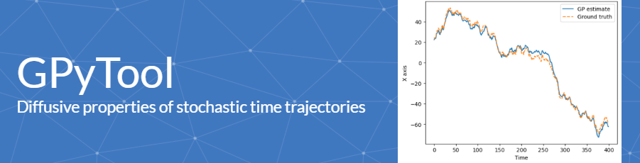

# GPyTool

GPyTool is the Python implementation of GP-FBM (Gaussian Process - Fractionnal Brownian Motion), a Bayesian framework developed to estimate the diffusive properties of a stochastic time trajectory.

## Description

By estimating the correlation between two trajectories, the GP-FBM framework can correct each individual trajectory for the substrate motion, inducing effective correlations between these two trajectories. GP-FBM was originally implemented through a C++ user-friendly interface, called GPTool, which also incorporates image processing tools (channels alignment, spot localization enhancement). This Python version, called GPyTool, incorporates the GP-FBM framework alone (no image processing tool); but 3D time trajectories (TXYZ) are now handled. GPyTool can be used to process single trajectories individually or with the substrate correction.

Original GP-FBM study: Oliveira, G.M., Oravecz, A., Kobi, D. et al. Precise measurements of chromatin diffusion dynamics by modeling using Gaussian processes. Nat Commun 12, 6184 (2021). https://doi.org/10.1038/s41467-021-26466-7

## Getting Started

### Dependencies

* GPyTool uses functions from the classical Python libraries Pandas, Scipy, Numpy and Matplotlib.
* The TKinter Python library is used to select the input trajectory files, but could be skipped if the path of these files is provided.

### Installing

* Download the GPyTool functions from the file GPyTool_functions.py
* Trajectory data files for demonstration are provided in the folder demo_data; alternatively, you can use your own trajectory file in CSV format (TXY - Time, X, Y - for 2D trajectory; TXYZ - Time, X, Y, Z - for 3D trajectory) or XML format (following the parsing from Icy software after tracking analysis, see example in the demo_data folder)

### Executing program

Import the Python libraries
```
import numpy as np
import pandas as pd
import matplotlib.pyplot as plt
from scipy.optimize import minimize
from pathlib import Path
import tkinter
from tkinter.filedialog import asksaveasfile, askopenfilenames
import re
import ntpath
import os.path
from matplotlib import colors
import time
import json
from GPyTool_functions import *
```
Set the time and spatial calibrations (physical size of a pixel in µm - calib_px) and (delay between two consecutive frames in seconds - calib_fr). The diffusion coefficient is directly linked to these calibrations (not the alpha anomalous exponent).
```
calib_px = 0.11 #1 px = 0.11 µm
calib_fr = 0.5 #1 frame = 0.5 s
```
The following part is used to process couple trajectories, with subtrate correction. Skip it if you want to process individually the trajectories (no substrate correction). The script first asks you to select a CSV file containing the names of the trajectory files (for example '260523_C36_tracer_1_SCR_CH1.xml'), two columns format; the header of this CSV file is 'traj_1,traj_2'. Each row corresponds to a run of GPyTool between the two trajectories mentionned in the two columns. For example, the row '260523_C36_tracer_1_SCR_CH1.xml' and '260523_C36_tracer_1_Sox2_CH1.xml' will analyze these two trajectories together, with substrate correction. the trajectories are expected to be CSV files (TXY or TXYZ formats) or XML (parsing from Icy software after tracking analysis) and they need to be located in the same folder as the CSV list file. After selecting the CSV file containing all the couples trajectories, the analysis starts. After each iteration of the script, a json file with the processed trajectories is saved in the same folder as the previous CSV file, with name 'results_XXXXXXXXX.json', where 'XXXXXXX' is a random number (used to avoid erasing previous results from previous analysis). At the end of the script, you get 'Done!'. During the process, some error message 'RuntimeWarning' can appear, but they do not perturb the analysis: they come from the minimization of a cost function. The final json file contains all the couple trajectories results: for each couple, the names of the two trajectories are saved, their anomalous exponents and diffusion coefficients with susbtrate correction, the alpha and D from the substrate itself and the estimated trajectory of the substrate.
```
results_json = gpytool_couple(calib_px, calib_fr)
```
The following part should be used to process each trajectory individually (no substrate correction). The output is a CSV file with the following structure: trajectory name (traj_ID), alpha exponent, diffusion coefficient (in µm²/s**alpha)
Just select the trajectories (csv or xml; xml parsing from Icy software after tracking analysis) and fill the name of the CSV results file.
```
results_csv = gpytool(calib_px, calib_fr)
```

## GPyTool with trajectory generator
Use the following scripts to generate stochastic trajectories with defined parameters :
N : trajectory length (number of time points);
D : diffusion coefficient;
alpha : anomalous exponent for diffusion

Load the Python libraries
```
import numpy as np
import pandas as pd
import matplotlib.pyplot as plt
from scipy.optimize import minimize
from pathlib import Path
import tkinter
from tkinter.filedialog import asksaveasfile, askopenfilenames
import re
import ntpath
import os.path
from matplotlib import colors
import time
import json
from GPyTool_functions import *
```
Set trajectories' parameters
```
N = 400 #trajectory length
alpha_1 = 0.45 #alpha trajectory 1
alpha_2 = 0.65 #alpha trajectory 2
alpha_back = 1.3 #alpha substrate motion
D_1 = 1 #diffusion coefficient trajectory 1
D_2 = 1 #diffusion coefficient trajectory 2
D_back = 1 #diffusion coefficient substrate motion
```
Generate two 2D trajectories with common substrate motion.
```
traj_back = generate_2Dtraj(N,D_back,alpha_back)
traj_1 = generate_2Dtraj(N,D_1,alpha_1)
traj_2 = generate_2Dtraj(N,D_2,alpha_2);
```
Or two 3D trajectories with common substrate motion
```
traj_back = generate_3Dtraj(N,D_back,alpha_back)
traj_1 = generate_3Dtraj(N,D_1,alpha_1)
traj_2 = generate_3Dtraj(N,D_2,alpha_2);
```
Run GPyTool on these two couple trajectories.
```
[res, traj_back_exp] = get_D_alpha_couple(traj_1+traj_back,traj_2+traj_back)
print('alpha_1 = '+str(res.x[1]))
print('D_1 = '+str(res.x[0]))
print('alpha_2 = '+str(res.x[3]))
print('D_2 = '+str(res.x[2]))
print('alpha_3 = '+str(res.x[5]))
print('D_3 = '+str(res.x[4]))
```
Plot the GP estimate of the substrate motion and compare to the ground truth.
```
y_label = ['X axis', 'Y axis', 'Z axis']
for i in range(traj_back_exp.shape[1]):
    plt.figure();plt.plot(traj_back_exp[:,i],label=('GP estimate'));plt.plot(traj_back[:,i]-np.mean(traj_back-traj_back_exp,axis = 0)[i],'--',label=('Ground truth'));
    plt.xlabel('Time');plt.ylabel(y_label[i]);plt.legend()
```

## Authors

Bastien Molcrette, Guilherme Monteiro Oliveira, Nacho Molina, Thomas Sexton (sexton@igbmc.fr)

## Version History

* 0.1
    * Initial Release

## License

This project is licensed under the MIT License - see the LICENSE.md file for details
